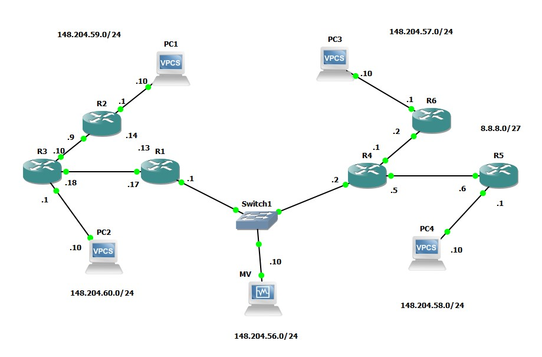
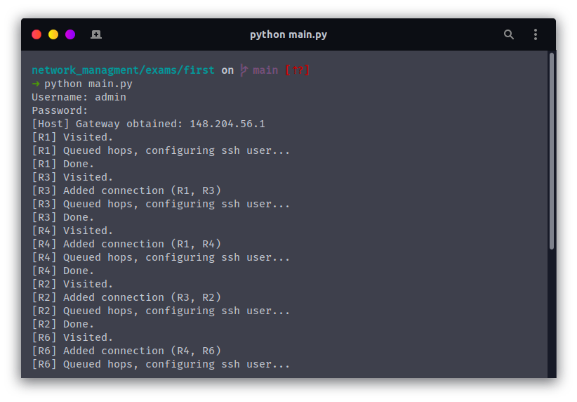
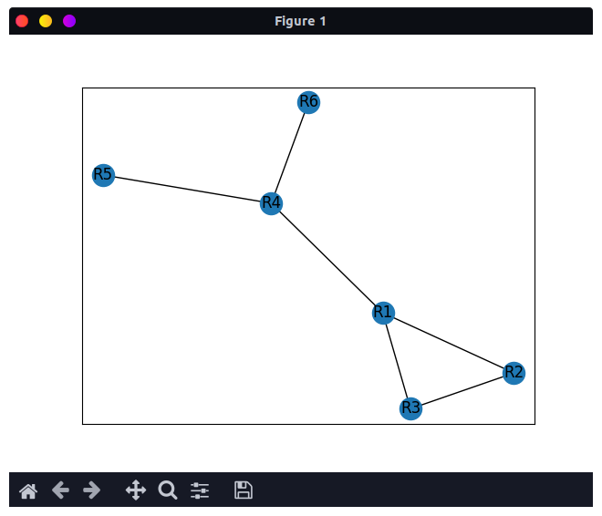

# Detección de la topología de red | Primer examen
## Descripción

Realizar un programa en Python que detecte la topología de una red de computadoras.

Agregar un nuevo usuario a un dispositivo de red de SSH de forma remota mediante un programa en Python.

Se creó la siguiente topología de red:



**NOTAS**
- Se utilizó el router **c7200**

## Configuración

### Subneteo

En las indicaciones nos dejaron subnetar la siguiente red para las conexiones de los routers:
```
8.8.8.0/27
```

Quedando las siguientes subredes:

```
8.8.8.0/32
8.8.8.4/32
8.8.8.8/32
8.8.8.12/32
8.8.8.16/32
```

Después se configuraron las distintas interfaces de los routers y las de las computadoras finales

Además se configuró OSPF.

## Uso

Se instalaron los siguientes paquetes de Python y de Linux para el tratamiento de grafos y su renderización:

```bash
sudo pip3 install networkx matplotlib 
```

También se requirió la librería de Linux graphviz y sus cabeceras de C:

```bash
sudo apt install install graphviz libgraphviz-dev pkg-config
sudo pip3 install pygraphviz
```

## Ejecución

Se resetean las llaves públicas ssh de las ip asociadas:
```bash
./reset.sh
```

Usando Python 3:
```bash
python main.py
```



Finalmente, el resultado es:


