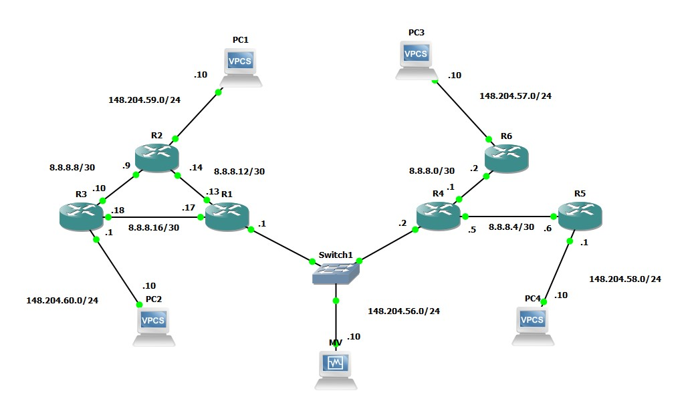
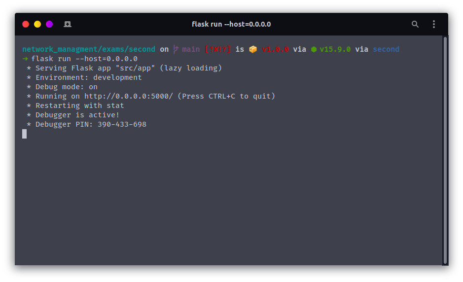
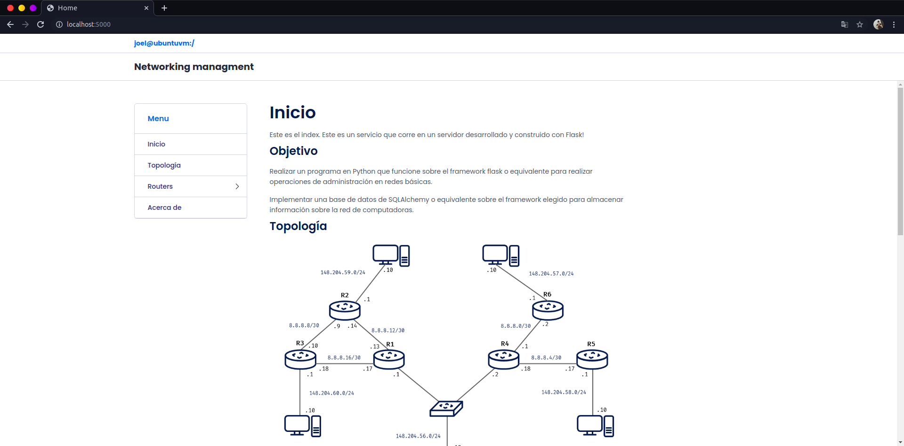
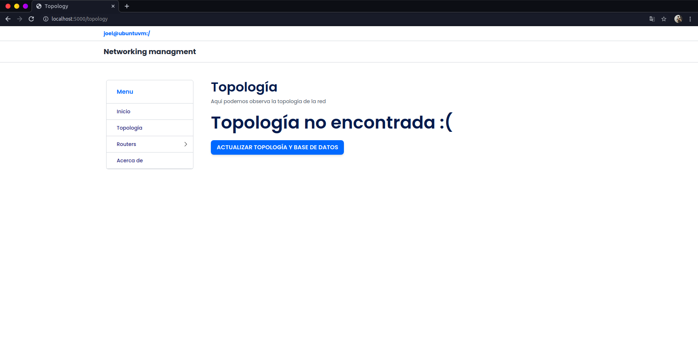
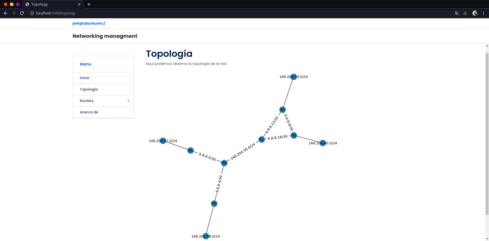
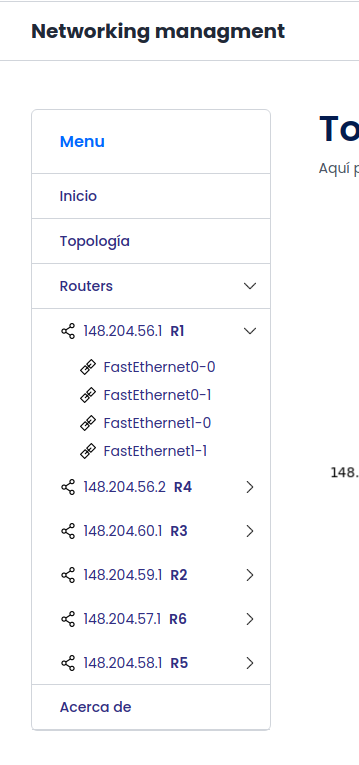
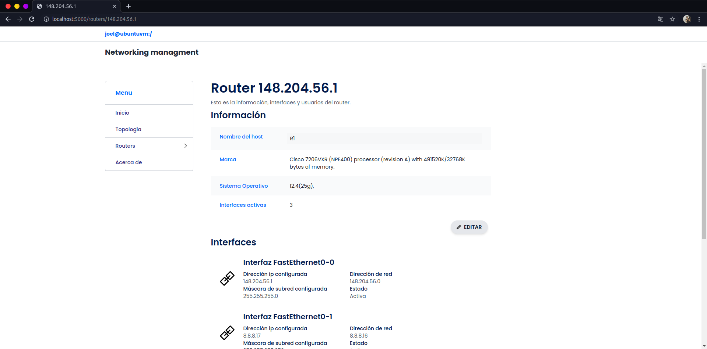
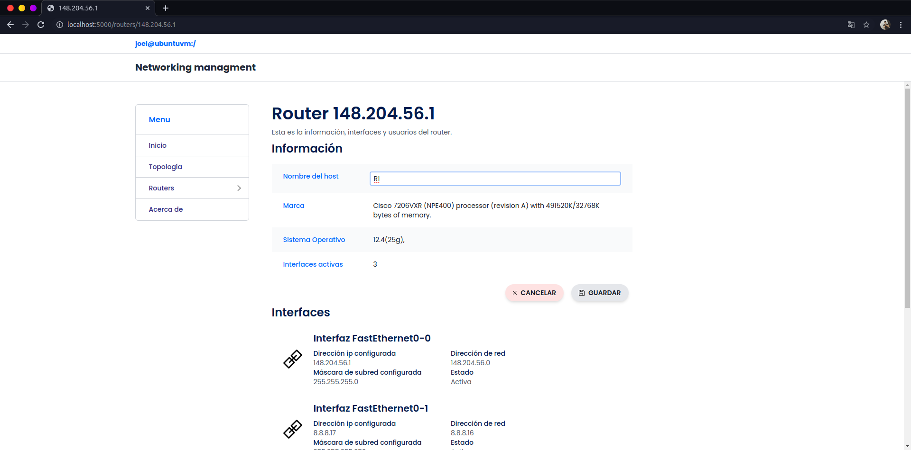
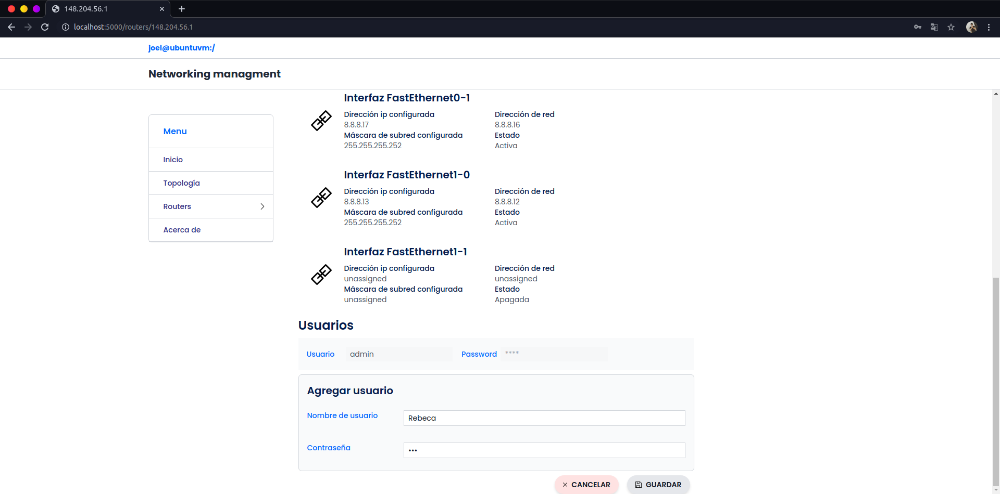
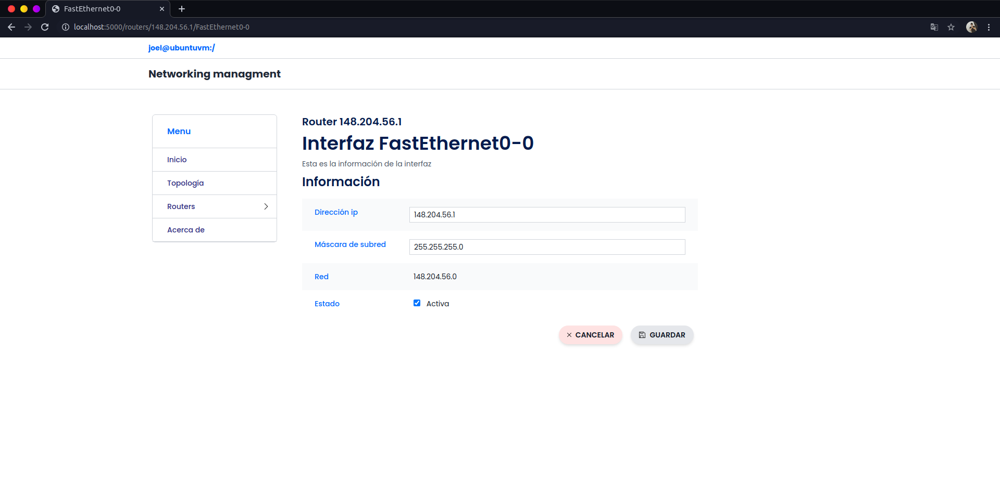

# Administración de una red | Segundo examen
## Descripción

Se deberá de implementar un programa en Python que usando el framework flask, SQLAlchemy y demás elementos permita mediante una interfaz de REST realizar las operaciones siguientes de administración de redes:
- Al arrancar obtenga de forma automática la dirección de la compuerta por defecto.
- La primera vez que se ejecute deberá de tener una liga URL que se encargue de explorar la topología de red y recabar la información necesaria para los siguientes puntos.
- Una vez realizada la operación anterior, agregarán una URL donde se pueda desplegar de forma gráfica la topología de red incluyendo subredes y la información de las direcciones IP y máscara.
- Al realizarse la operación 2 agregar accesos a URLs para poder acceder a datos de cada dispositivo donde se puede observar la información de los enrutadores de la red incluyendo:
    - ID (IP más alta de sus enlaces).
    - Hostname
    - Marca
    - Versión del sistema operativo
    - Número de interfaces activas
- Y guardarse en la base de datos.
- Agregar accesos a URLs para cada una de las interfaces activas de los enrutadores encontrados, agrupados como subdirecciones del punto anterior, guardarlo en la base de datos presentando la - siguiente información:
    - IP y máscara asignada.
    - IP e ID de enrutador o subred a la que está conectado.
    - Después de la operación 2, agregarán dos opciones:
    - Una opción para modificar datos en la base de datos de los enrutadores y las interfaces activas de cada uno de ellos.
    - Una para consultar, agregar, modificar o eliminar usuarios de los enrutadores que deberán de guardarse en la base de datos.
- Para calificar el examen, se pedirá que se desactiven algunas conexiones entre los enrutadores y el programa deberá de reconocer la topología resultante. Se revisará que los enrutadores tengan únicamente la configuración indicada en el documento.
- El programa no deberá de tener ninguna dirección IP preconfigurada.


Se creó la siguiente topología de red:



**NOTAS**
- Se utilizó el router **c7200**

## Uso

Se crea un ambiente virtual de python y se activa:

```bash
python3 -m venv env
source env/bin/activate
```

Se instalan los paquetes via pip (**require conexión a internet**):

```bash
pip install -r requirements.txt
```

Se instalan los paquetes via npm (**require conexión a internet**):

```bash
npm install
```

Se compilan las fuentes de letra y el framework de utilidades Tailwindcss:

```bash
npm run gulp
```

Finalmente, corremos el servidor Flask:

```bash
npm start
```

Abrimos el navegador en localhost en el puerto 5000:

[http://localhost:5000/](http://localhost:5000/)

**Para desactivar el ambiente virtual**
```bash
deactivate
```

## Ejecución

El servidor es ejecutado:



Abrimos el navegador en localhost en el puerto 5000: [http://localhost:5000/](http://localhost:5000/)



Navegamos hacia la sección `topología`, en el menú de navegación que se encuentra en la izquierda.

Le damos clic al botón `ACTUALIZAR TOPOLOGÍA Y BASE DE DATOS` y el script de configuración se ejecutará:



Una vez terminado el proceso, nos aparecerá la topología:



En el menú de la izquierda nos aparecerán todos los dispositivos que hayan en la red, junto con las interfaces:



Observamos la información de algún router:



Modificamos información del router:



Modificamos los usuarios que pueden acceder mediante ssh:



Igualmente podemos ver y modificar la información de las interfaces:


