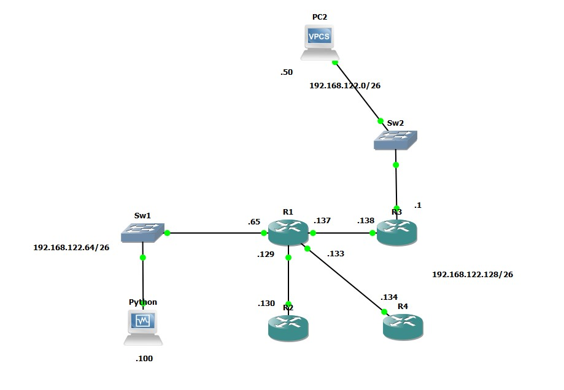

# Configuración automática de SSH por Telnet
## Práctica 1.2
### Descripción

Se creó la siguiente topología de red:

**NOTAS**
- Se utilizó el router **c7200**

#### Tabla posible de configuración

(Las interfaces pueden variar)

<table>
<thead>
  <tr>
    <th>Dispositivos</th>
    <th>Interfaz</th>
    <th>IP</th>
    <th>PREFIX</th>
  </tr>
</thead>
<tbody>
  <tr>
    <td rowspan="4">R1</td>
    <td>Fa0/0</td>
    <td>192.168.122.65</td>
    <td>26</td>
  </tr>
  <tr>
    <td>Fa0/1</td>
    <td>192.168.122.137</td>
    <td>30</td>
  </tr>
  <tr>
    <td>Fa1/0</td>
    <td>192.168.122.129</td>
    <td>30</td>
  </tr>
  <tr>
    <td>Fa1/1</td>
    <td>192.168.122.133</td>
    <td>30</td>
  </tr>
  <tr>
    <td rowspan="1">R2</td>
    <td>Fa0/0</td>
    <td>192.168.122.130</td>
    <td>30</td>
  </tr>
  <tr>
    <td rowspan="2">R3</td>
    <td>Fa0/0</td>
    <td>192.168.122.1</td>
    <td>26</td>
  </tr>
  <tr>
    <td>Fa0/1</td>
    <td>192.168.122.138</td>
    <td>30</td>
  </tr>
  <tr>
    <td rowspan="1">R4</td>
    <td>Fa0/0</td>
    <td>192.168.122.134</td>
    <td>30</td>
  </tr>
</tbody>
</table>