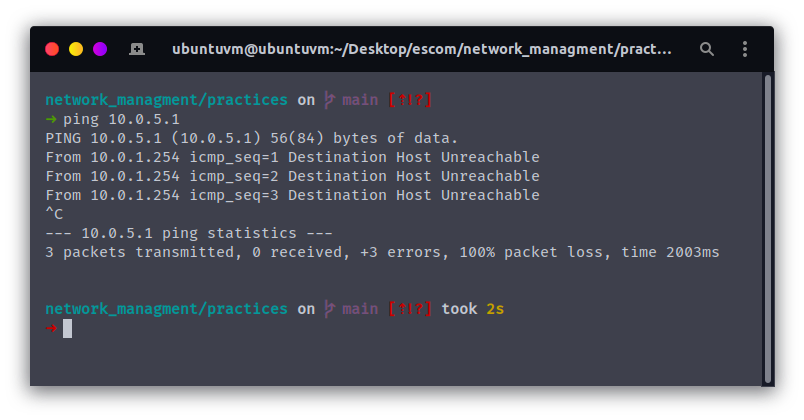
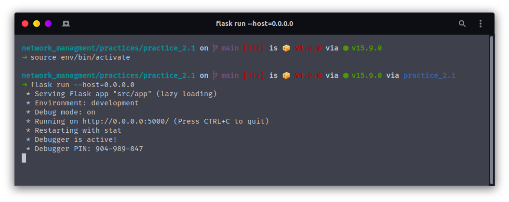
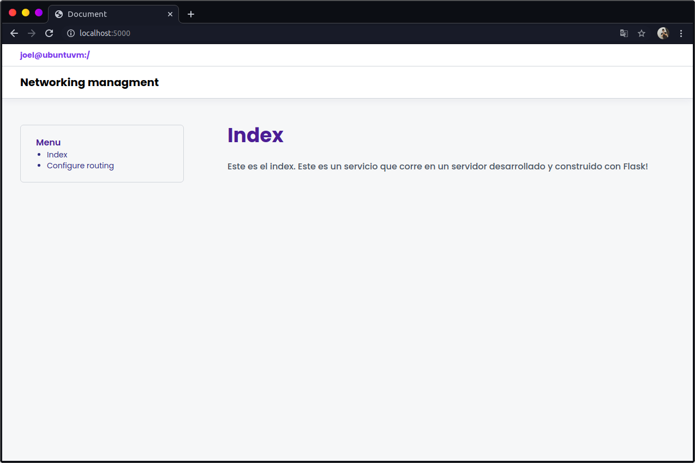
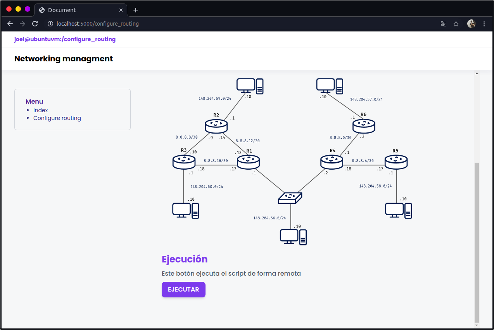
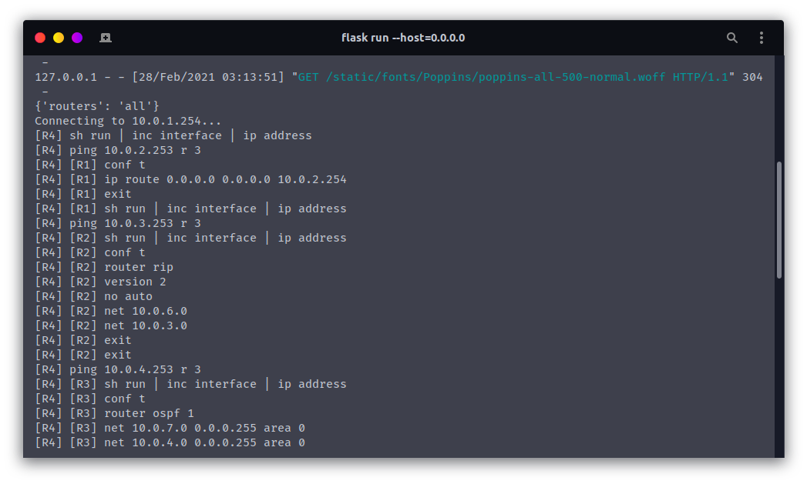
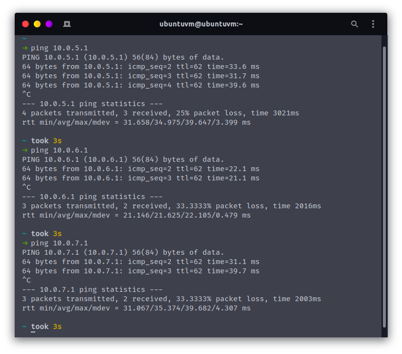

# Enrutamiento múltiple | Práctica 2.1
## Descripción

Desarrollar un programa en Python que sea capaz de levantar el enrutamiento estático y dinámico de la columna vertebral de una topología con múltiples métodos de enrutamiento.

Implementar en GNS3 la siguiente topología, donde únicamente se van a configurar las interfaces indicadas en enrutadores, MV y VPCS y un usuario `admin` con contraseña `admin` en ssh de los enrutadores.

Desarrollar un programa en Python que correrá en la máquina virtual host1 y que sea capaz
levantar los distintos métodos de enrutamiento indicados en la topología y permitir que exista conectividad en toda la red.

Se creó la siguiente topología de red:


El programa no contendrá ninguna dirección IP y deberá de ser capaza de ir localizando los diferentes router (por su nombre), así como levantar los tipos de enrutamiento según la siguiente tabla:

Enrutador | Estático | RIP | OSPF
--- | --- | --- | ---
R1 | Sí | |
R2 | | Sí | 
R3 | | | Sí 
R4 | Sí | Sí | Sí 


**NOTAS**
- Se utilizó el router **c7200**

## Configuración

### Configuración individual de cada dispositivo

- [R1](./docs/configuration/r1.md)
- [R2](./docs/configuration/r2.md)
- [R3](./docs/configuration/r3.md)
- [R4](./docs/configuration/r4.md)

## Uso

Se crea un ambiente virtual de python y se activa:

```bash
python3 -m venv env
source env/bin/activate
```

Se instalan los paquetes via pip (**require conexión a internet**):

```bash
pip install -r requirements.txt
```

Se instalan los paquetes via npm (**require conexión a internet**):

```bash
npm install
```

Se compilan las fuentes de letra y el framework de utilidades Tailwindcss:

```bash
npm run gulp
```

Finalmente, corremos el servidor Flask:

```bash
npm start
```

Abrimos el navegador en localhost en el puerto 5000:

[http://localhost:5000/](http://localhost:5000/)

**Para desactivar el ambiente virtual**
```bash
deactivate
```

## Ejecución

Hacemos ping desde la vm a la pc1, no hay comunicación:


El servidor es ejecutado:



Abrimos el navegador en localhost en el puerto 5000: [http://localhost:5000/](http://localhost:5000/)




Navegamos hacia `configure routing`, en la parte posterior de la página:



Le damos clic al botón y el script de configuración se ejecutará:




Finalmente, cuando el script se haya terminado de ejecutar, veremos el siguiente mensaje:


Ahora, probamos la conexión con pc1, pc2 y pc3:


