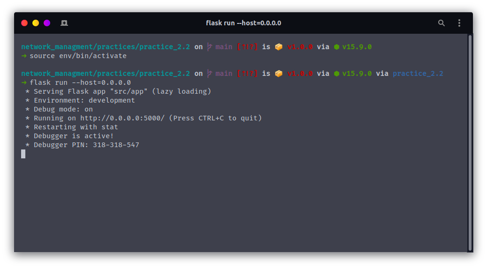

# Enrutamiento múltiple | Práctica 2.1
## Descripción

Se deberá de crear un programa en Python que nos permitan realizar altas, bajas y consultas de VLAN en la topología indicada.

El programa deberá de permitir ver las VLAN existentes, así como la subred que le corresponde y las interfaces que tiene relacionadas.

La información de las VLANs se guardará en una base de datos y se actualizará.

Los tres switch funcionaran como espejo, es decir que deberán de tener las mismas VLAN. El Switch 1 deberá de funcionar como servidor VTP y los otros dos como cliente (no se usará la interfaz FastEthernet0/14).

### Requisitos

Al arrancar el programa en Python, nos pedirá usuario y contraseña para poder acceder vía SSH tanto a los switch como al router, después, nos presentará un menú que ofrezca las siguientes opciones:

- Consultar las VLAN existentes e interfaces relacionadas
- Crear una nueva VLAN
- Borrar una nueva VLAN

### Consulta de VLAN
Al solicitar la consulta de una VLAN, desplegará todas las vlan existentes con la siguiente información:

- Número
- Nombre
- Identificador de subred
- Máscara de subred
- Default Gateway
- Interfaces relacionadas a este.

### Creación de una VLAN
Al solicitar la creación de una nueva VLAN, preguntara por un **número, nombre, identificador de subred, máscara de subred e interfaces** que se van a relacionar. 

El programa se conectará con los switch para crear las VLAN y asignará número, nombre, compuerta por defecto (utilizar la primera ip válida de la subred relacionada), y cambiará las interfaces a dicha vlan. Se repetirá para cada switch relacionado.

También se conectará con el router y asignará a la subinterfaz con el mismo número de VLAN la dirección de la compuerta por defecto relacionada.

### Eliminación de una VLAN

Al solicitar la eliminación de una VLAN, se solicitará el número de VLAN. Primeramente, se conectará con el router y eliminará la subinterfaz relacionada, después, en cada uno de los switch cambiará las interfaces que tenga relacionadas a la VLAN 1, para posteriormente eliminar la VLAN indicada.

## Topología

Se creó la siguiente topología de red:


**NOTAS**
- Se utilizó el router **c7200**

## Configuración

### Configuración individual de cada dispositivo

- [R1](./docs/configuration/r1.md)
- [ESW1](./docs/configuration/sw1.md)
- [ESW2](./docs/configuration/sw2.md)
- [ESW3](./docs/configuration/sw3.md)

## Uso

Se crea un ambiente virtual de python y se activa:

```bash
python3 -m venv env
source env/bin/activate
```

Se instalan los paquetes via pip (**require conexión a internet**):

```bash
pip install -r requirements.txt
```

Se instalan los paquetes via npm (**require conexión a internet**):

```bash
npm install
```

Se compilan las fuentes de letra y el framework de utilidades Tailwindcss:

```bash
npm run gulp
```

Finalmente, corremos el servidor Flask:

```bash
npm start
```

Abrimos el navegador en localhost en el puerto 5000:

[http://localhost:5000/](http://localhost:5000/)

**Para desactivar el ambiente virtual**
```bash
deactivate
```

## Ejecución

El servidor es ejecutado:



Abrimos el navegador en localhost en el puerto 5000: [http://localhost:5000/](http://localhost:5000/).


Ingresamos nuestras credenciales ssh previamente configuradas:


Nos mostrará una pantalla vacía, y procedemos a dar clic en el botón de `actualizar`:


Una vez actualizada la base de datos, nos mostrará una única VLAN, la VLAN 1:


Consultamos los datos de la VLAN1:


Regresamos al inicio y nos movemos a la sección de agregar vlan e ingresamos los datos para agregar la vlan 10 (para agregar interfaces a la VLAN, damos clic sobre el nombre de cada una de las interfaces que queremos agregar):


La agregamos y finalizando el proceso podremos observar la vlan que acabamos de crear:


Observamos la información de dicha VLAN:


Probamos la configuración desde la máquina que esté conectada al switch en alguna interfaz de la VLAN en cuestión:


Eliminamos la VLAN:


Y volvemos a probar la configuración en la pc anterior:

