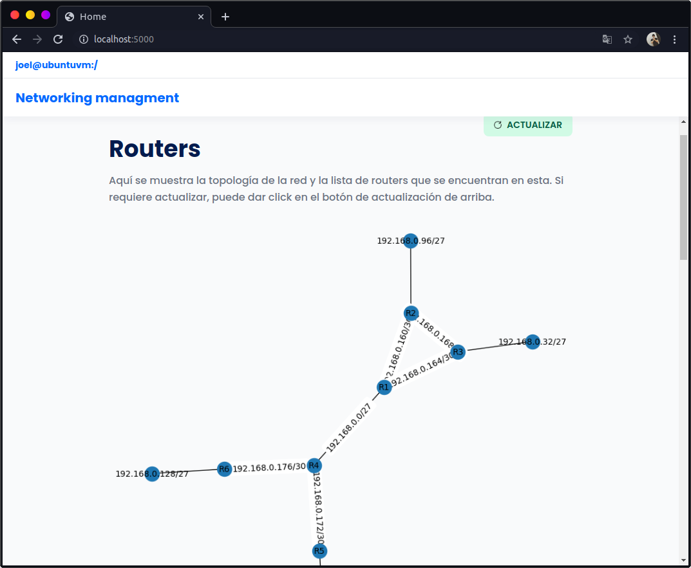

# Monitoreo de redes usando snmp | Práctica 3.1
## Descripción

- Implementar un pequeño repositorio de recursos de administración de red sobre una plataforma web que use Flask y Python para su funcionamiento.
- Utilizar pexpect y pysnmp para obtener información sobre los dispositivos en una red.
- Utilizar SQLAlchemy para crear una base de datos simple para almacenar información relacionada con la administración de la red.
- A partir de la dirección de Gateway del servidor y con un usuario de la red (común a todos los dispositivos) descubrir la topología de la red y presentarla de forma gráfica.
- Cree una opción para desplegar mediante el uso de SNMP la información de cada dispositivo y guárdela en una BD:
    - SysDescr
    - SysContact
    - SysName
    - SysLocation
- Cree una opción para poder desplegar apoyado por SNMP como va evolucionando en el tiempo (cada minuto) los siguientes valores en cada una de las interfaces conectadas de los diferentes dispositivos de red:
    - Número de octetos de entrada
    - Número de octetos de salida
    - Número de paquetes de entrada
    - Número de paquetes de salida
- Crear una opción para el monitoreo de paquetes perdidos de salida de alguno de los enlaces en su red que envíe un mensaje de error cuando la pérdida de paquetes sea superior a un valor (en porcentaje) definido.
- Crear una opción para poder cambiar el hostname de cualquiera de los routers de la red.


Se creó la siguiente topología de red:


**NOTAS**
- Se utilizó el router **c7200**

## Configuración

### Tabla de configuración de direcciones

(Las interfaces pueden variar)

<table>
<thead>
  <tr>
    <th>Dispositivos</th>
    <th>Interfaz</th>
    <th>IP</th>
    <th>Prefijo</th>
  </tr>
</thead>
<tbody>

  <tr>
    <td rowspan="4">R1</td>
    <td>Lo0</td>
    <td>192.168.10.1</td>
    <td>24</td>
  </tr>
  <tr>
    <td>Fa0/0</td>
    <td>192.168.0.1</td>
    <td>27</td>
  </tr>
  <tr>
    <td>Fa0/1</td>
    <td>192.168.0.161</td>
    <td>30</td>
  </tr>
  <tr>
    <td>Fa1/0</td>
    <td>192.168.0.165</td>
    <td>30</td>
  </tr>

  <tr>
    <td rowspan="4">R2</td>
    <td>Lo0</td>
    <td>192.168.10.2</td>
    <td>24</td>
  </tr>
  <tr>
    <td>Fa0/0</td>
    <td>192.168.0.97</td>
    <td>27</td>
  </tr>
  <tr>
    <td>Fa0/1</td>
    <td>192.168.0.162</td>
    <td>30</td>
  </tr>
  <tr>
    <td>Fa1/0</td>
    <td>192.168.0.170</td>
    <td>30</td>
  </tr>

  <tr>
    <td rowspan="4">R3</td>
    <td>Lo0</td>
    <td>192.168.10.3</td>
    <td>24</td>
  </tr>
  <tr>
    <td>Fa0/0</td>
    <td>192.168.0.33</td>
    <td>27</td>
  </tr>
  <tr>
    <td>Fa0/1</td>
    <td>192.168.0.169</td>
    <td>30</td>
  </tr>
  <tr>
    <td>Fa1/0</td>
    <td>192.168.0.166</td>
    <td>30</td>
  </tr>

  <tr>
    <td rowspan="4">R4</td>
    <td>Lo0</td>
    <td>192.168.10.4</td>
    <td>24</td>
  </tr>
  <tr>
    <td>Fa0/0</td>
    <td>192.168.0.2</td>
    <td>27</td>
  </tr>
  <tr>
    <td>Fa0/1</td>
    <td>192.168.0.173</td>
    <td>30</td>
  </tr>
  <tr>
    <td>Fa1/0</td>
    <td>192.168.0.177</td>
    <td>30</td>
  </tr>


  <tr>
    <td rowspan="3">R5</td>
    <td>Lo0</td>
    <td>192.168.10.5</td>
    <td>24</td>
  </tr>
  <tr>
    <td>Fa0/0</td>
    <td>192.168.0.65</td>
    <td>27</td>
  </tr>
  <tr>
    <td>Fa0/1</td>
    <td>192.168.0.174</td>
    <td>30</td>
  </tr>

  <tr>
    <td rowspan="3">R6</td>
    <td>Lo0</td>
    <td>192.168.10.6</td>
    <td>24</td>
  </tr>
  <tr>
    <td>Fa0/0</td>
    <td>192.168.0.129</td>
    <td>27</td>
  </tr>
  <tr>
    <td>Fa0/1</td>
    <td>192.168.0.178</td>
    <td>30</td>
  </tr>
</tbody>
</table>

### Configuración individual de cada dispositivo

- [R1](./docs/configuration/r1.md)
- [R2](./docs/configuration/r2.md)
- [R3](./docs/configuration/r3.md)
- [R4](./docs/configuration/r4.md)
- [R5](./docs/configuration/r5.md)
- [R6](./docs/configuration/r6.md)


## Uso

Se crea un ambiente virtual de python y se activa:

```bash
python3 -m venv env
source env/bin/activate
```

Se instalan los paquetes via pip (**require conexión a internet**):

```bash
pip install -r requirements.txt
```

Se instalan los paquetes via npm (**require conexión a internet**):

```bash
npm install
```

Se compilan las fuentes de letra y el framework de utilidades Tailwindcss:

```bash
npm run gulp
```

Finalmente, corremos el servidor Flask:

```bash
npm start
```

Abrimos el navegador en localhost en el puerto 5000:

[http://localhost:5000/](http://localhost:5000/)

**Para desactivar el ambiente virtual**
```bash
deactivate
```

## Ejecución

El servidor es ejecutado:


Abrimos el navegador en localhost en el puerto 5000: [http://localhost:5000/](http://localhost:5000/).


Ingresamos nuestras credenciales ssh previamente configuradas:


Nos mostrará una pantalla vacía, y procedemos a dar clic en el botón de `actualizar`:


Una vez actualizada la base de datos, nos mostrará una única VLAN, la VLAN 1:



Consultamos los datos de la VLAN1:


Regresamos al inicio y nos movemos a la sección de agregar vlan e ingresamos los datos para agregar la vlan 10 (para agregar interfaces a la VLAN, damos clic sobre el nombre de cada una de las interfaces que queremos agregar):


La agregamos y finalizando el proceso podremos observar la vlan que acabamos de crear:


Observamos la información de dicha VLAN:


Probamos la configuración desde la máquina que esté conectada al switch en alguna interfaz de la VLAN en cuestión:


Eliminamos la VLAN:


Y volvemos a probar la configuración en la pc anterior:

